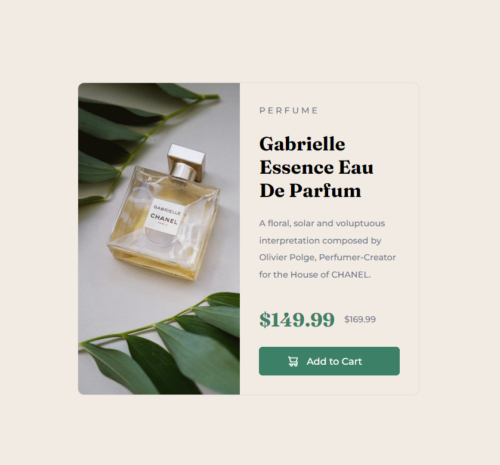

# Frontend Mentor - Product preview card component solution

This is a solution to the [Product preview card component challenge on Frontend Mentor](https://www.frontendmentor.io/challenges/product-preview-card-component-GO7UmttRfa). Frontend Mentor challenges help you improve your coding skills by building realistic projects. 

## Table of contents

- [Overview](#overview)
  - [The challenge](#the-challenge)
  - [Screenshot](#screenshot)
  - [Links](#links)
- [My process](#my-process)
  - [Built with](#built-with)
  - [What I learned](#what-i-learned)
  - [Continued development](#continued-development)
  - [Useful resources](#useful-resources)
- [Author](#author)

## Overview

### The challenge

Users should be able to:

- View the optimal layout depending on their device's screen size
- See hover and focus states for interactive elements

### Screenshot
- Desktop

- Portrait

### Links

- Solution URL: [Add solution URL here](https://your-solution-url.com)
- Live Site URL: [Add live site URL here](https://your-live-site-url.com)

## My process
- Built the HTML structure.
- Builded the Desktop Design.
- Made the changes for portrait mode.

### Built with

- Semantic HTML5 markup
- CSS custom properties
- Flexbox
- Desktop-first workflow

### What I learned
 I practiced responsive design and working with flexbox.
### Continued development

- Responsive Deisgn

### Useful resources

- [Add svg as an image](https://www.freecodecamp.org/news/use-svg-images-in-css-html/#:~:text=SVG%20images%20can%20be%20written,element%20in%20your%20HTML%20document.) - This helped me to add the svg icon as an image.
- [border-radius tips](https://youtu.be/j3Z4DR0o8bk) - This amazing video showed me some trics with border-radius.
## Author

- Frontend Mentor - [MorbitDemon](https://www.frontendmentor.io/profile/MorbitDemon)